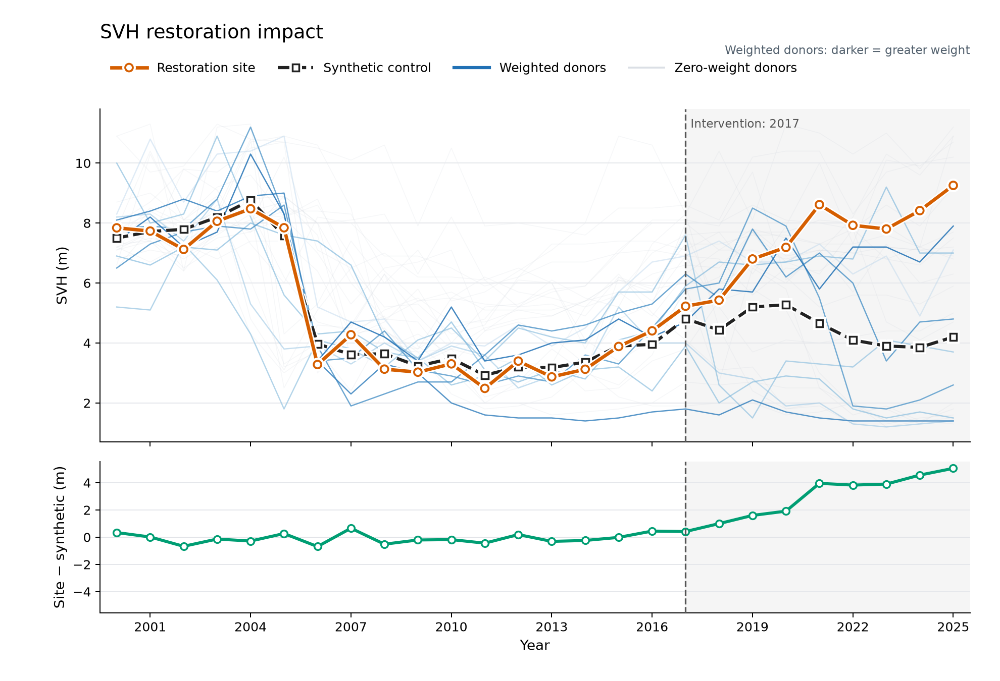

# Restoration counterfactuals

Explore restoration impacts for a single project using Google Earth Engine data. The notebook selects comparable donor pixels and fits separate synthetic controls for above-ground biomass (AGB) and short vegetation height (SVH), then plots observed outcomes against the estimated counterfactual.



## Get started

With [uv](https://docs.astral.sh/uv/) installed:

```sh
git clone https://github.com/speckerf/restoration-counterfactuals.git
cd restoration-counterfactuals
uv sync
```

Open [main.ipynb](main.ipynb) in your notebook editor, select `.venv/bin/python` as the kernel, and run the cells from the repository root. Set `EE_PROJECT` to your own Earth Engine-enabled Google Cloud project and authenticate when prompted.

## Experiment

- Choose an example site or supply a GeoJSON boundary with an integer `intervention_year` property.
- Adjust sampling, search buffers, and matching thresholds in [config.yaml](config.yaml); each option is documented there.
- Inspect the matching map, then compare observed and synthetic trajectories.

The notebook passes an empty neighboring-project collection by default. Supply boundaries through `other_projects` to exclude nearby restoration projects from the donor pool.
